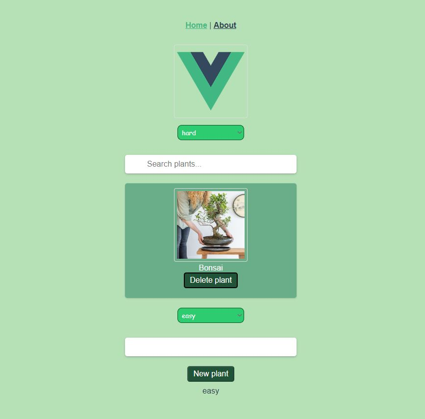

# plant-searcher


## Project omschrijving
```
Project is het eerstse echte project dat is gemaakt voor de stage bij Uniware. 
Uniware is een bedrijf dat software maakt voor bloemen en plantenkwekers. 
Dit project is gemaakt ter inspiratie op hun webshop en dient als oefening voor het werken met het framework VueJS. 
Het project is gemaakt in VUE2. In dit project kan de gebruiker tussen een lijst van planten filteren. 
Filteren tussen de tags die deze planten hebben (hard en easy). Zelf planten toevoegen aan de lijst en daarbij ook een van de tags kiezen om mee te geven. 
Daarnaast kunnen de items ook nog verwijderd worden
```

### To do
```
1.Correct volgorde verwijderen van de items (index?)
2.Mogelijk maken om zelf afbeeldingen toe te voegen en deze in de array met items te plaatsen 
3.Meerdere tags mogelijk per plant 
4.API?
```

### Codesandbox.io
```
https://codesandbox.io/p/github/michafvdw/plant-searcher/csb-b192tb/plant-searcher?file=%2FREADME.md 
```


### Compiles and hot-reloads for development
```
yarn serve
```

